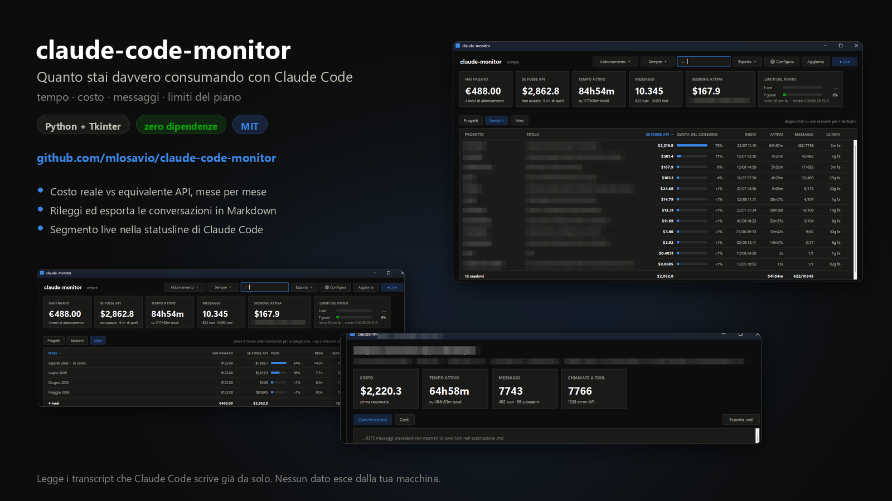

# CodeAgentMonitor (CAM)

**Italiano** · [English](README.en.md)

Tempo, costo e numero di messaggi delle conversazioni **Claude Code** e **GitHub Copilot**,
ricavati dai file che quegli strumenti scrivono già in locale. Con interfaccia grafica,
cruscotto live nel terminale e un segmento per la statusline.

Per un gruppo di lavoro c'è anche un [raccoglitore della telemetria](#più-macchine-il-pannello-di-team)
che mette insieme più macchine, con tre livelli di riservatezza fra cui scegliere.

Solo libreria standard: **nessuna dipendenza da installare**, né Python né npm.

 



*Nelle schermate i nomi dei progetti e i titoli delle conversazioni sono offuscati.*

> **Si chiamava `claude-code-monitor`.** Ha cambiato nome quando ha smesso di leggere solo
> Claude Code. Se stai aggiornando da una versione precedente non devi fare niente: i comandi
> sono `python cam.py` invece di `python claude_monitor.py`, e archivio, chiave dei
> pseudonimi e stato del raccoglitore [traslocano da soli](#se-arrivi-da-claude-code-monitor)
> alla prima esecuzione.

---

## A cosa serve

Claude Code non dice quanto stai consumando, né dove. Questo strumento legge i transcript che
scrive già da solo e risponde a tre domande diverse, che è facile confondere:

- **quanto ho consumato** — token, messaggi, tempo di lavoro effettivo, e quanta parte dei
  limiti del piano hai usato;
- **quanto varrebbe a listino API** — il valore di quel consumo, che con un abbonamento
  **non paghi**;
- **quanto ho speso davvero** — la quota mensile, oppure l'addebito a consumo se usi l'API.

```
MESE       SESS  PROG     TOKEN  OUTPUT  SE FOSSE API   PAGATO   RESA
2026-03 *     9     4  1842.20M   5.10M      $1,204.6   $20.00  60.2×
2026-02       6     3   980.44M   2.31M        $612.8   $20.00  30.6×
2026-01       1     1     4.02M     71k          $4.10   $20.00   0.2×
TOTALE                 2826.66M   7.48M      $1,821.5   $60.00  30.4×
```

Gennaio a `0,2×` vuol dire che la quota di quel mese è stata pagata quasi a vuoto.

---

## Installazione

Serve **Python 3.9+** e Claude Code. Niente altro.

```bat
git clone https://github.com/mlosavio/CodeAgentMonitor.git
cd CodeAgentMonitor
copy config.example.json config.json
python cam.py
```

Su **Debian e Ubuntu** l'interfaccia grafica vuole un pacchetto in più: lì `tkinter` non
arriva con Python, sta a parte. Il CLI funziona anche senza.

```sh
sudo apt install python3-tk        # solo per python cam_gui.py
```

Apri `config.json` (o il pulsante **Configura** nella GUI) e metti il tuo piano e quanto paghi
al mese: è l'unico dato che il tool non può ricavare da solo.

Per il segmento nella statusline di Claude Code:

```bat
python install_statusline.py           :: installa
python install_statusline.py --wrap    :: conserva la statusline che hai già
```

---

## Uso

```bat
python cam_gui.py           :: interfaccia grafica
python cam.py               :: riepilogo delle ultime sessioni
python cam.py --by-month    :: consumo, speso e resa per mese
python cam.py --by-project  :: totali per progetto
python cam.py --traces      :: un turno per riga, non una sessione
python cam.py --trend       :: andamento nel tempo e indicatori
python cam.py --watch       :: cruscotto live nel terminale
python cam.py --json        :: output machine-readable
```

| Opzione | Effetto |
|---|---|
| `--base PATH` | cartella dei transcript (default `%USERPROFILE%\.claude\projects`) |
| `--config PATH` | file di configurazione alternativo |
| `--billing subscription\|api` | come viene pagato l'uso, sovrascrive la configurazione |
| `--project NOME` | filtra per sottostringa del percorso o del progetto |
| `--since` | `7d`, `24h`, `90m`, `oggi`, `2026-03-01` |
| `--top N` | massimo di sessioni (o di turni con `--session`); `0` = tutte |
| `--session UUID` | dettaglio di una sessione, anche solo col prefisso |
| `--traces` | [un turno per riga](#i-turni) invece di una sessione; con `--json` li include |
| `--search TESTO` | con `--traces`: cerca nel prompt, negli strumenti, nel progetto — e [nelle risposte](#cercare-e-vedere-dove) se il testo è archiviato |
| `--export-turni FILE.jsonl` | [i turni selezionati come dataset](#esportare-i-turni-come-dataset) |
| `--trend` | [andamento nel tempo e indicatori](#andamenti-e-indicatori) |
| `--grana giorno\|settimana\|mese` | con `--trend`: ampiezza del periodo |
| `--finestra GIORNI` | con `--trend`: giorni confrontati con i GIORNI precedenti |
| `--chat` | con `--session`: la conversazione in Markdown |
| `--watch` / `--interval S` | live sulla sessione modificata più di recente |
| `--idle-gap S` | pausa oltre la quale il tempo non è "attivo" (default 300s) |
| `--no-cache` / `--clear-cache` | ignora / svuota la cache di analisi ([l'archivio resta](#larchivio-cam-localdb)) |
| `--dimentica-testo` | cancella dall'archivio il testo delle conversazioni; i numeri restano |
| `--archivio` | [quanto pesa l'archivio e da cosa](#quanto-pesa-e-come-farlo-calare) |
| `--no-color` | niente ANSI (rispetta anche `NO_COLOR`) |

Le sessioni di [GitHub Copilot](#github-copilot) compaiono accanto a quelle di Claude Code,
con costo e token a «—».

---

## Interfaccia grafica

```bat
python  cam_gui.py     :: con console, per vedere i traceback
pythonw cam_gui.py     :: senza console
```

Stessa logica del CLI (lo importa come modulo), quindi i numeri coincidono alla cifra.

- **Tessere** in alto: quanto hai pagato, quanto varrebbe a listino, tempo attivo, messaggi,
  sessione in corso e **consumo dei limiti del piano**.
- Sei schede: **Progetti**, **Sessioni** (con il titolo che Claude Code assegna alla
  conversazione), **[Traces](#i-turni)**, **[Andamento](#andamenti-e-indicatori)**, **Mesi** e
  **Persone**. Colonne ordinabili; l'ordinamento usa i valori numerici, non le stringhe
  formattate, quindi `$2,055.7` non finisce sotto `$301.4`.
- **Persone** mostra il consumo di più macchine e compare popolata solo se hai avviato il
  [raccoglitore](#più-macchine-il-pannello-di-team). L'intestazione della prima colonna dice
  *Persona*, *Postazione* o *Insieme* a seconda del livello di riservatezza in vigore, così si
  capisce senza chiedere se si stanno guardando persone o codici. **Doppio click su una
  postazione** apre su cosa ha lavorato, progetto per progetto: è la vista per il ribaltamento
  sulle commesse. Se hai caricato l'export di fatturazione, accanto a *Hai pagato* — che è la
  stima del modello — compare *Fatturato*, che è quello che la console addebita davvero; e
  **compaiono anche le postazioni che pagano senza consumare**, che altrimenti non esisterebbero
  in nessuna riga.
- **Ogni intestazione ha la sua spiegazione** al passaggio del mouse.
- **Doppio click su una sessione** apre la conversazione, rileggibile, con export in Markdown.
- **Doppio click su un turno** nella scheda Traces apre i suoi span: dove è finito il tempo.
- La **casella di ricerca** cerca nei nomi dei progetti, nei titoli e **nel testo dei tuoi
  prompt e nei nomi degli strumenti usati**. Una sessione resta visibile anche quando il testo
  cercato sta solo in uno dei suoi turni; col testo archiviato, sotto ogni turno compare
  [il pezzo di conversazione in cui la parola sta](#cercare-e-vedere-dove).
- **Nella scheda Persone**, il chip *⚠ n da controllare* isola le postazioni su cui fatturazione
  e consumo [non combaciano](#la-terza-fonte-lexport-di-fatturazione), e sopra la tabella c'è
  [l'adozione mese per mese](#ladozione-mese-per-mese).
- **Live**: la tessera di destra segue la sessione attiva e si aggiorna ogni 2 s leggendo solo
  i byte nuovi del transcript. Diventa verde quando quella sessione sta lavorando.
- **Aggiornamento automatico ogni 5 minuti**, configurabile.
- Filtri per periodo e progetto, export JSON e [JSONL dei turni](#esportare-i-turni-come-dataset), `Ctrl+C` copia la riga, F5 aggiorna.

Aspetto: superfici piatte, tabella disegnata su Canvas, tema chiaro/scuro che segue il sistema
(barra del titolo inclusa) e si forza con `--light` / `--dark`.

Opzioni: `--theme auto|light|dark`, `--tab progetti|sessioni|traces|andamento|mesi|persone`, `--live`,
`--detail <uuid>`, `--auto-refresh MIN`, `--locale us|it`.

Il pulsante **Configura** apre le impostazioni vere, non il file JSON: abbonamento, team,
aspetto, statusline e listino. Se una modifica richiede il riavvio, l'applicazione si riavvia
da sola.

---

## Rileggere le conversazioni

**Doppio click su un progetto** nella scheda Progetti scende alle sue conversazioni: filtra e
passa alla scheda Sessioni. Per tornare a tutte, svuota il filtro.

La scheda **Sessioni** è l'indice della history: titolo, data, progetto, durata, costo. Doppio
click su una riga:

- **Conversazione** — quello che hai chiesto e quello che è stato fatto, in ordine, con le
  chiamate a tool riassunte in una riga (`⚙ Read, Bash, Edit`) invece che riportate per intero;
- **Costi** — lo stesso percorso ma con token e costo per turno;
- **Esporta .md** — la conversazione in Markdown, con titolo, data, durata e costi in testa.

### Esportare un progetto intero

Il menu **Esporta ▾** ha due voci: *Dati in JSON* (i numeri, per elaborarli altrove) e
**Conversazioni in Markdown**, che esporta **tutto quello che stai vedendo** — quindi filtra
per progetto o per periodo e poi esporta. Produce una cartella per progetto più un indice:

```
esportazione/
  indice.md
  MioProgetto/
    2026-03-14 Rifare il layout della dashboard [a1b2c3d4].md
    2026-03-02 Aggiungere export CSV [e5f6a7b8].md
  SitoWeb/
    2026-02-20 Ottimizzare le immagini [c9d0e1f2].md
```

`indice.md` raggruppa per progetto e per ognuno elenca data, titolo (in link al file),
messaggi, tempo attivo e valore a listino. Il nome dei file parte dalla data, così l'ordine
alfabetico è già quello cronologico.

Da riga di comando, con gli stessi filtri:

```bat
python cam.py --session a1b2c3d4 --chat > conversazione.md
python cam.py --project MioProgetto --export-md .\esportazione
python cam.py --since 30d --export-md .\esportazione --with-subagents
```

I messaggi dei subagent sono esclusi per default: sono lavoro interno e spezzerebbero il filo
del discorso. Nella finestra si vedono al massimo gli ultimi 400 messaggi; l'esportazione li
contiene tutti.

L'esportazione rilegge ogni sessione per intero — il testo non sta nella cache, che tiene solo
i numeri — quindi su molte conversazioni ci vuole qualche minuto. Nella GUI gira su un thread
separato con avanzamento nella barra di stato, e sopra le 40 conversazioni chiede conferma.

### Dove sono salvate

**Le conversazioni non le salva questo strumento**: le scrive già Claude Code, un file JSONL
per sessione, e qui si leggono in sola lettura.

```
%USERPROFILE%\.claude\projects\<progetto>\<uuid>.jsonl
```

**I transcript però scadono.** Claude Code ha `cleanupPeriodDays`, che cancella quelli più
vecchi di N giorni. Se vuoi conservarli a lungo, in `~/.claude/settings.json`:

```json
"cleanupPeriodDays": 3650
```

Il costo è lo spazio su disco, che cresce di qualche centinaio di MB al mese di uso intenso.
Per le conversazioni che ti interessano davvero, l'esportazione in Markdown resta il modo più
solido: è un file tuo, leggibile senza questo tool e senza Claude Code.

### L'archivio: `cam-local.db`

I **numeri** invece sì: stanno in un SQLite accanto allo script. Fino alla versione precedente
era `.cache.json`, un blocco unico riscritto per intero e buttato via ogni volta che cambiava
il formato del parser; al primo avvio viene travasato dentro l'archivio e cancellato.

L'archivio ha due metà con regole opposte, ed è tutto lì:

| tabella | cos'è | si può buttare? |
|---|---|---|
| `file` | il record derivato da ogni transcript, con dimensione e data | **sì**: si rilegge |
| `sessione`, `turno` | quello che si è misurato | **no**, non sempre — vedi sotto |

Ogni sessione dice da dove viene:

- `origine = 'derivato'` — tutti i suoi transcript esistono ancora, la riga si può ricostruire;
- `origine = 'acquisito'` — ne manca almeno uno (`file_mancanti` dice quanti), oppure la fonte
  non ha mai avuto un transcript.

Da questa distinzione discende la regola che tiene in piedi il resto: **si cancella e si
ricostruisce solo ciò che è derivato**. Un cambio di formato del parser svuota la tabella
`file` e non tocca l'archivio — `--clear-cache` fa la stessa cosa a mano. Il peso di una
migrazione futura resta così proporzionale ai soli dati che nessuna rilettura potrebbe rifare.

### Le sessioni che sopravvivono al transcript

Quando `cleanupPeriodDays` cancella un transcript, la sua riga in `file` sparisce ma **la
sessione e i suoi turni restano**, marcati acquisiti — e continuano a comparire nei conti,
segnati con **▪** nelle schede Sessioni e Traces e nel CLI. Sono l'unica memoria che rimane di
quel lavoro: senza, il costo di un mese passato calerebbe da solo col tempo.

Aprendole si vede quello che è rimasto:

| | c'è ancora? |
|---|---|
| numeri della sessione e dei turni | **sì**, tutti |
| conversazione | **sì**, se `archivio.testo` era acceso |
| cascata degli span | **no**: vive nel dettaglio che non si archivia |
| risultati degli strumenti | **no**, mai archiviati |

Se invece sparisce **solo uno** dei file di una sessione — tipicamente quello di un subagent —
la sessione continua a essere scansionata e i suoi numeri **calano**, perché quel lavoro non si
può più leggere e non si inventa. `file_mancanti` dice di quanti file si tratta, così la
differenza resta spiegabile invece di essere un calo misterioso.

### Archiviare anche il testo

Di default nell'archivio ci sono **solo numeri**, più i primi 200 caratteri dei tuoi prompt per
riconoscere un turno in un elenco. Il contenuto delle conversazioni si archivia solo se glielo
chiedi — *Configura → Archivio*, oppure in `config.json`:

```json
"archivio": { "testo": true }
```

Ci finiscono **le tue domande e le risposte**, non i risultati degli strumenti: su una sessione
vera il testo è l'1,6% del transcript e tutto il resto sono contenuti di file e output di
comandi, già su disco e che nessuno rilegge. Su 227 MB di transcript sono circa 4 MB.

Cosa cambia, acceso:

- **la ricerca entra dentro le risposte**, con un indice a testo pieno (SQLite FTS5, con
  fallback su `LIKE` se quella copia di SQLite non ce l'ha); si cerca da tre lettere in su;
- **una conversazione resta leggibile dopo che il suo transcript è sparito**: è l'unico modo
  per non perderla quando scatta `cleanupPeriodDays`.

Accenderlo fa rileggere tutti i transcript una volta — quelli già in cache erano stati letti
senza tenere il testo. Spegnerlo non cancella niente: per cancellare c'è
`python cam.py --dimentica-testo`, che toglie il testo e lascia i numeri.

Tenere su disco il contenuto delle proprie conversazioni è una decisione, non un default da
scoprire dopo: per questo è spento, e per questo c'è un modo esplicito per disfarlo.

L'archivio non serve a rendere il monitor veloce — su 227 MB di transcript la rilettura completa
costa meno di due secondi, perché i file hanno poche righe lunghissime. Serve a **interrogare**
quello che si è misurato:

```sql
SELECT substr(session_id,1,8), round(costo,2), richieste, tool, substr(prompt,1,40)
FROM turno ORDER BY costo DESC LIMIT 10;
```

e a **conservarlo** quando il transcript non c'è più. `*.db` è già in `.gitignore`.

### Quanto pesa, e come farlo calare

```
python cam.py --archivio
```

dice quanto occupa il file e **da cosa** — senza quella risposta le uniche mosse possibili
sono cancellare tutto o non toccare niente:

```
      1.1 MB  in tutto
    452.4 KB  turni                  40%
    371.2 KB  cache di analisi       33%
     25.8 KB  sessioni                2%
```

La cache di analisi è **compressa**. Dentro c'è soprattutto la lista dei timestamp di ogni
evento, che da sola pesa più di tutto il resto messo insieme (708 KB su 1,2 MB in chiaro):
serve a ricalcolare durate e tempo attivo cambiando `--idle-gap` **senza rileggere i
transcript**, ed è l'unica ragione per cui la si conserva. Comprimerla la riduce più di quanto
la ridurrebbe buttarla via a metà — a poco più di un quarto, contro un terzo — e non toglie
niente a nessuno. Gli archivi scritti dalle versioni precedenti si convertono da soli, una
volta, al primo avvio.

`--dimentica-testo` compatta il file dopo aver cancellato: senza, le pagine liberate restano
*dentro* il file e a chi ha appena chiesto di dimenticare qualcosa sembra — a ragione — che non
sia successo niente.

Quello che **non** c'è, di proposito: una politica di cancellazione automatica per età. Una
regola che sbaglia, su un archivio che è l'unica copia rimasta di conversazioni cancellate,
distrugge quello che doveva proteggere.

---

## I turni

Una sessione può durare giorni e costare centinaia di dollari: come unità di misura è troppo
grossa per capire *dove* siano finiti. Il **turno** — una tua domanda e tutto quello che ne è
seguito, fino alla domanda dopo — è la grana in cui si lavora davvero.

```bat
python cam.py --traces --top 20
python cam.py --traces --search riconciliazione
```

```
INIZIO       PROGETTO   SESSIONE  DURATA  REQ  TOOL  CACHE  TOKEN  COSTO  MODELLO          PROMPT
13/08 09:16  gestionale  a1b2c3d4  6m48s   16    15  99.3%  5.28M  $3.46  claude-opus-4-8  sistemare l'export in CSV…
13/08 08:52  gestionale  a1b2c3d4  1m59s    1     0   8.8%   309k  $2.95  claude-opus-4-8  serve davvero quel servizio…
```

Le due righe sopra dicono una cosa che il totale di sessione nasconde: il secondo turno è
costato quasi quanto il primo **con una richiesta sola e nessuno strumento**. La colonna
`CACHE` spiega perché — 8,8% contro 99,3%: lì il contesto è stato riscritto da capo, e la
riscrittura si paga il doppio dell'input.

Nella GUI è la scheda **Traces**. Doppio click su un turno apre tre viste:

- **Trace** — token per tipo, costo, cache hit, modelli, strumenti usati, subagent coinvolti;
- **Conversazione** — cosa è stato detto in *quel* turno, non nell'intera sessione;
- **Span** — la cascata: la richiesta al modello e ogni strumento, con la sua durata reale.

Dalla scheda Sessioni si scende ai turni di una sola conversazione col pulsante **Vedi i
turni**; il chip in alto ricorda il filtro e lo toglie con un click.

### Come si ricava la durata di una richiesta

Il transcript non registra quanto è durata una chiamata al modello: scrive solo l'istante in
cui la risposta è arrivata. Ma l'istante in cui è **partita** è l'ultimo evento precedente — il
tuo prompt, oppure il risultato dello strumento che l'ha sbloccata. La differenza fra i due è
l'attesa vera. Gli strumenti invece hanno inizio e fine espliciti: la riga che li invoca e
quella che ne riporta il risultato.

Ne esce che il tempo di un turno quasi mai se ne va nel modello: se ne va in uno strumento
fermo ad aspettare un permesso, o in un comando lento. La cascata lo rende evidente.

### Come i turni restano al posto giusto

Il raggruppamento usa il **timestamp**, non la posizione nel file. Non è un dettaglio: Claude
Code riemette interi segmenti di storia — stesso uuid, stesso timestamp — anche migliaia di
righe più avanti (fork, `--resume`, compattazione). Raggruppando per posizione quelle righe
finirebbero nell'ultimo turno, che si prenderebbe il costo di tutta la conversazione.

Tre casi che il codice tratta apposta, e che le prove in `test_traces.py` sorvegliano:

- **I prompt di sidechain non aprono un turno.** Nel transcript principale sono
  l'orchestratore che istruisce un subagent *dentro* un turno già aperto: aprirne uno nuovo
  spezzerebbe in due il turno del padre.
- **I turni dei subagent non sono turni della conversazione.** Il loro consumo viene sommato
  al turno del padre che li conteneva, così il costo di un turno comprende gli agenti che ha
  lanciato. La colonna `REQ` li conta.
- **Le richieste precedenti al primo prompt non si perdono**: finiscono in un turno senza
  prompt, in testa all'elenco.

Somma di controllo: **il costo dei turni fa esattamente quello della sessione**. Ogni richiesta
finisce in uno e un solo turno.

### Cache hit

`cache_read / (cache_read + input + cache_write)`: quanta parte di ciò che è entrato nel
modello arrivava dalla cache invece che a prezzo pieno. L'output resta fuori dal conto — è
quello che il modello produce, non quello che gli si dà da leggere.

Su una conversazione lunga sta stabilmente sopra il 95%. Un valore basso su un turno singolo
non è un guasto: è il momento in cui il contesto è stato riscritto, ed è lì che il turno costa.

### Span, e cosa NON c'è

Uno span è un pezzo del turno con un inizio e una fine: la radice `interaction`, un
`llm_request` per chiamata al modello, un `tool:<nome>` per strumento. Il conteggio in fondo
alla scheda li somma come fa ProxyAgent.

Gli span **non stanno nell'archivio**: si ricostruiscono rileggendo il transcript quando si apre
un turno. Tenerli per ogni sessione vorrebbe dire portarsi dietro argomenti e risultati di ogni
comando — megabyte per un dettaglio che si guarda una volta. Il prezzo è un attimo di attesa
all'apertura di un turno di una sessione grossa.

### Cercare, e vedere dove

**La ricerca** cerca sempre nei tuoi prompt, nei nomi degli strumenti, nei progetti e nei
titoli. Se hai acceso [`archivio.testo`](#archiviare-anche-il-testo) entra anche **dentro le
risposte**, con un indice a testo pieno — e allora ogni turno porta con sé **il pezzo di
conversazione in cui la parola compare**, con l'etichetta di chi l'ha detta:

```
13/08 14:30  a1b2c3d4 #14  risposta  …l'«archivio» li produce già e vengono buttati via…
13/08 13:31  a1b2c3d4 #10  risposta  …le sue righe vanno in «archivio» come acquisite…
13/08 13:50  a1b2c3d4 #13  tu        …apri_«archivio»(use_cache, quiet, testo)…
```

Nella GUI lo stesso frammento compare come seconda riga sotto il turno. È la differenza fra una
ricerca che **restringe un elenco** e una che **risponde**: senza, sapresti quanti turni
contengono la parola e non dove.

### Esportare i turni come dataset

```bat
python cam.py --traces --search riconciliazione --export-turni turni.jsonl
```

Un turno per riga, con domanda, risposta, modelli, durata, strumenti, costo, cache hit e se è
stato interrotto — cioè già la forma in cui si valuta un prompt o si confronta un modello. Nella
GUI è *Esporta → Turni selezionati in JSONL*.

Il criterio di selezione non è un secondo insieme di regole da imparare: **è il filtro che hai
davanti**. Cerchi «riconciliazione», restringi a una sessione, esporti quello.

Le risposte vengono dall'archivio del testo. Senza, escono `null` e il comando dice **quanti**
turni sono usciti senza: un dataset con metà delle risposte vuote è peggio di nessun dataset, e
non deve sembrare completo.

---

## Andamenti e indicatori

Totali e classifiche dicono *quanto*. Non dicono se sta crescendo, se sta migliorando, o se
qualcosa è peggiorato la settimana scorsa. Per quello c'è la scheda **Andamento**, e da riga
di comando `--trend`.

```bat
python cam.py --trend
python cam.py --trend --grana mese
python cam.py --trend --finestra 7      :: confronta 7 giorni con i 7 prima
```

```
PERIODO    VALORE  TURNI   TEMPO  PER TURNO  MEDIANA  CACHE  SESS  PROG  INTER
22/06       $3.80      8  14h55m    $0.4745      25s  79.1%     1     1
29/06          $0      0      0s          —        —      —     0     0
06/07      $38.29     15   3h05m      $2.55    3m14s  98.8%     2     2
13/07      $172.6     36   9h10m      $4.79    9m11s  98.5%     2     2
```

Nel pannello la stessa cosa è un grafico — una metrica per volta, scelta da un menu — più una
riga di **indicatori** che confrontano il periodo recente con quello di pari lunghezza appena
prima. Il pulsante **Tabella** mostra gli stessi numeri in righe: un grafico senza la sua
tabella lascia fuori chi non può leggerlo.

### Tre scelte che cambiano quello che si legge

**I periodi vuoti ci sono.** Una settimana senza lavoro vale zero ed è disegnata: saltarla
accosterebbe due punti lontani e farebbe sembrare continuo un uso che continuo non è stato.

**Le somme si riempiono da zero, i livelli no.** Costo e turni sono quantità: l'area sotto la
linea *è* la quantità, quindi parte da zero. Cache hit e durata mediana sono livelli: non
partono da niente, e schiacciarli su un asse 0–100% renderebbe piatta una riga che invece si
muove. Sono disegnati come linea sola, con l'asse adattato — e **spezzata dove non c'è dato**,
perché una settimana senza turni non ha una cache hit, e tirarci sopra una linea la farebbe
sembrare misurata.

**Mai due scale sullo stesso grafico.** Costo e turni non vanno insieme: l'allineamento fra i
due assi sarebbe arbitrario e inventerebbe una correlazione che nei dati non c'è. Una metrica
per grafico, si cambia dal menu.

### I rapporti si calcolano sui token, non sulle percentuali

La cache hit di una settimana è `cache_read / token in ingresso` **di tutta la settimana**, non
la media delle percentuali dei singoli turni. La differenza non è teorica: un turno da mille
token con cache al 0% e uno da un milione con cache al 99,99% fanno una media del 50% e una
verità del 99,99%. La media delle percentuali darebbe lo stesso peso ai due turni.

### La freccia si colora solo dove salire vuol dire qualcosa

Ogni indicatore dichiara da che parte sta il bene:

| indicatore | se sale |
|---|---|
| Cache hit, Giorni di lavoro, Progetti | **meglio** — verde |
| Turni interrotti | **peggio** — ambra |
| Turni, Costo per turno, Durata mediana, Strumenti per turno | **dipende** — grigio |

«Costo per turno» che sale può voler dire che si stanno affrontando lavori più grossi, o che si
sta sprecando: senza sapere cosa si stava facendo, una freccia verde sarebbe una bugia detta
con sicurezza. Il colore c'è solo dove il verso è certo; passando il mouse su un indicatore si
legge cosa vuol dire che salga.

Gli indicatori di **adozione** — giorni di lavoro, progetti toccati, progetti nuovi — rispondono
alla domanda diversa da «quanto costa»: se lo strumento sta entrando nel lavoro o è rimasto un
esperimento. Per più postazioni la domanda equivalente è quante di quelle pagate sono attive, e
quella sta nella [scheda Persone](#più-macchine-il-pannello-di-team).

---

## GitHub Copilot

Seconda sorgente, letta dallo storage delle chat di VS Code. **Accesa di default**: leggere
quei file è lo stesso gesto che leggere i transcript di Claude Code — file già sul disco, della
stessa persona, sulla stessa macchina. Per spegnerla, in `config.json`:

```json
"copilot": { "enabled": false }
```

```
%APPDATA%\Code\User\workspaceStorage\<hash>\chatSessions\*.json    legate a un progetto
%APPDATA%\Code\User\globalStorage\emptyWindowChatSessions\*.json   aperte senza cartella
```

Il progetto si ricava da `workspace.json` accanto alle chat. Le sessioni aperte senza cartella
compaiono lo stesso, sotto *(senza progetto)*: sono lavoro fatto, e scartarle perché non si sa
dove collocarlo vorrebbe dire perderlo.

### Cosa arriva, e cosa no

| | c'è? |
|---|---|
| turni, orari, titolo, progetto | **sì** |
| **latenza, misurata** | **sì** — `totalElapsed`, più precisa di quella che [deduciamo](#come-si-ricava-la-durata-di-una-richiesta) per Claude Code |
| modello | **sì** — `copilot/claude-sonnet-4.5`, `copilot/auto`, … |
| domande e risposte | **sì** |
| chiamate agli strumenti, con i nomi | **sì** — `copilot_readFile`, `run_in_terminal`, … |
| **token** | **no** |
| **costo** | **no** |

I token non ci sono e non sono deducibili: le uniche chiavi che li nominano sono
`maxInputTokens` e `maxOutputTokens`, che sono i **limiti del modello**, non il consumo.

**Quei numeri restano «—», mai zero.** Copilot si paga a quota fissa per postazione: un «se
fosse API» calcolato lì sarebbe una cifra inventata, e verrebbe letta come una spesa. Uno zero
sarebbe un'altra bugia — direbbe che quel turno non ha consumato niente. Il trattino dice la
sola cosa vera: qui non si sa. Sotto le tabelle c'è una riga che lo spiega, perché un «—» in una
colonna di costi si legge come uno zero se nessuno dice il contrario.

Le colonne **Fonte** nelle schede Sessioni e Traces dicono da dove viene ogni riga.

### Perché è una fonte diversa, non un secondo transcript

Copilot **non scrive un transcript**. Quello è storage interno di VS Code, in un formato non
pubblico che cambia con le versioni dell'estensione. Su una fonte così non si può dire «se il
parser sbaglia, si rilegge»: il file di oggi domani può non esserci o avere un'altra forma.

Perciò quello che si legge finisce in [archivio](#larchivio-cam-localdb) come
`origine = 'acquisito'` e non si prova a ricostruirlo — è la stessa regola che vale per i
transcript scaduti. E un file con una forma inattesa fa perdere quella sessione, non fa cadere
il programma: le prove ne costruiscono apposta di rotti, vuoti e con turni malformati.

Una cosa che il formato non dice: **quanti giri fra modello e strumenti** ci sono stati in un
turno. Il file registra una richiesta per turno, quindi `REQ` vale 1 e non è una stima.

---

## Cosa hai speso davvero

Con l'abbonamento **l'unica cifra uscita dal conto è la quota mensile**. Tutto il resto misura
il consumo, non la spesa.

| colonna | cos'è | l'hai pagato? |
|---|---|---|
| **`PAGATO`** (vista `--by-month`) | la quota mensile | **sì**, è l'unico importo vero |
| **`SE FOSSE API`** | quanto sarebbe costato a listino API | **no**, mai |
| **`QUOTA DEL CONSUMO`** | quanto pesa una riga sul consumo totale | è una percentuale, non una spesa |

Gli euro compaiono **solo dove sono veri**: nella vista mensile. Nelle viste per progetto e per
sessione la colonna è una percentuale di consumo.

### Perché non ripartisco la quota sui progetti

Una versione precedente lo faceva, mese per mese, in proporzione al consumo. Il risultato era
indifendibile: un progetto da `$3,80` e 32 minuti di lavoro si prendeva il **25%** di tutto,
perché era l'unico attivo in un mese in cui la quota era stata pagata comunque.

Il difetto non è aritmetico ma concettuale: **quella quota non l'ha causata quel progetto.**
L'avresti pagata anche non aprendo Claude Code. Era capacità comprata e non usata, e il modello
la scaricava sull'unica riga presente. E ripartendo sull'intero periodo invece che mese per
mese, la colonna diventa *identica* alla quota di consumo: non aggiungeva informazione,
aggiungeva solo un modo di sbagliarsi.

La quota non sfruttata si legge dove ha senso, cioè nella vista **Mesi**: un mese con
`RESA 0,2×` è un mese pagato quasi a vuoto.

### Abbonamento o API

Lo switch è in `config.json` → `billing.mode`, ribaltabile con `--billing api` o dal menu nella
GUI:

- **`subscription`** — quota fissa. Il costo per token è solo un riferimento;
- **`api`** — a consumo: il costo per token *è* l'addebito, e le due colonne diventano una sola.

Si possono marcare singoli progetti o sessioni come a consumo pur restando in abbonamento,
utile se li lanci con `ANTHROPIC_API_KEY`:

```json
"billing": { "mode": "subscription", "api_projects": ["ProgettoX"], "api_sessions": [] }
```

### Una sessione può stare a cavallo di due mesi

Attribuirla tutta a un mese falserebbe entrambi, quindi i token vengono **buckettizzati per
mese al momento del parsing**, messaggio per messaggio:

```
MioProgetto  se fosse API $1.204,60
   2026-02   se fosse API   $412,30
   2026-03   se fosse API   $792,30
```

La somma dei bucket mensili coincide con il totale delle sessioni alla sesta cifra decimale.

---

## I limiti del piano

Non esistono finestre "giornaliere": Claude Code ne espone **due**, una di **5 ore** e una di
**7 giorni**, entrambe in percentuale usata. Si vedono in due posti, con affidabilità diversa:

| Dove | Sorgente | Freschezza |
|---|---|---|
| **Statusline** | il payload che Claude Code passa al comando, dagli header della risposta API | sempre attuale |
| **Tessera nella GUI** | `~/.claude.json` → `cachedUsageUtilization` | vale quanto l'ultimo aggiornamento |

Il file su disco lo aggiorna Claude Code **solo quando parla con l'API**, e lo considera
scaduto dopo un'ora. Per questo la tessera **non mostra numeri in cui non si può credere**:
una finestra il cui reset è già passato diventa `—`, e l'età del dato è sempre scritta sotto
(`letto 23 ore fa`). Un `—` non vuol dire "consumo zero", vuol dire "quel numero non vale più".

---

## Più macchine: il pannello di team

I transcript coprono la tua macchina e basta. Per vedere un gruppo di lavoro serve un'altra
fonte, e **Claude Code ce l'ha già**: sa esportare da sé la propria telemetria via
OpenTelemetry, senza che sulle postazioni debba girare niente di scritto da noi.

`cam_collector.py` riceve quel flusso e lo conserva. Riceve **OTLP in codifica JSON su HTTP**,
quindi niente protobuf e nessuna dipendenza: solo stdlib, come tutto il resto.

Per provarlo su una macchina sola, tre comandi:

```bat
python cam_collector.py --setup          :: stampa la configurazione da mettere in settings.json
python cam_collector.py                  :: avvia il raccoglitore su 127.0.0.1:4318
python cam_collector.py --report --by user
```

Poi **riavvia Claude Code**: le variabili d'ambiente si leggono all'avvio, le sessioni già
aperte non esportano nulla. Il cruscotto è su `http://127.0.0.1:4318/`, e nel pannello grafico
compare la scheda **Persone**.

Per un gruppo di lavoro le due metà si separano: il raccoglitore su **una** macchina, la
telemetria e l'agente su **ognuna** delle altre. Le due sezioni che seguono sono l'installazione
completa, nell'ordine in cui va fatta — prima il raccoglitore, perché è l'indirizzo che serve
alle postazioni.

Le due guide complete, passo per passo, stanno in [`docs/`](docs/):

| | Quando |
|---|---|
| **[Attivare CAM nel team, in sede](docs/team-in-sede.md)** | tutte le postazioni sulla stessa rete aziendale |
| **[Attivare CAM in un team distribuito](docs/team-distribuito.md)** | case, uffici diversi, gente in viaggio — e il pannello riservato a un amministratore |

> **Le postazioni non sono tutte sulla stessa rete?** Allora la procedura qui sotto non basta:
> apre la porta in chiaro e dà a ogni postazione un token che apre anche il cruscotto. Vai
> direttamente alla seconda guida.

### Attivarlo, parte prima: la macchina che raccoglie

Una sola per tutto il gruppo. Le serve Python 3.9+, di essere raggiungibile dalle postazioni
sulla porta scelta, e di essere accesa quando si lavora. Non le serve potenza: cinquanta
postazioni fanno una richiesta ogni diciotto secondi, e il raccoglitore ne regge cinquecento al
secondo (§ *Quanto grande può essere il gruppo*).

**1. Un token condiviso.** Aprire alla rete senza è come lasciare l'archivio scrivibile da
chiunque sia in rete: il raccoglitore avverte all'avvio, ma non impedisce.

```bat
python -c "import secrets; print(secrets.token_urlsafe(24))"
```

**2. Avvialo.** `--host 0.0.0.0` significa "su tutte le interfacce", non è un indirizzo a cui
collegarsi.

```bat
python cam_collector.py --host 0.0.0.0 --port 4318 --token IL-TOKEN ^
    --privacy pseudonimo ^
    --db C:\claude-team\cam-team.db ^
    --key C:\claude-team\chiavi\cam-pseudonimi.key
```

Tieni **la chiave in una cartella diversa dall'archivio**, con permessi diversi: chi ha
l'archivio non deve poter risalire alle persone. È tutto il senso del livello intermedio, e
metterli nella stessa cartella lo annulla senza che nulla smetta di funzionare.

**3. Apri la porta**, da PowerShell come amministratore. Solo il profilo di dominio: non è un
servizio da esporre altrove.

```powershell
New-NetFirewallRule -DisplayName 'cam-collector' -Direction Inbound `
    -Protocol TCP -LocalPort 4318 -Action Allow -Profile Domain
```

**4. Fallo ripartire da solo.** Un raccoglitore fermo **non lascia traccia**: l'esportatore
ritenta per poco e poi lascia perdere, e quell'intervallo non si recupera più. È la differenza
con l'agente, che invece l'arretrato lo ricalcola.

```bat
python cam_collector.py --setup-service --host 0.0.0.0 --port 4318 --privacy pseudonimo --db C:\claude-team\cam-team.db
```

Stampa il comando già compilato con questi parametri: collegamento in Esecuzione automatica
(senza privilegi), attività pianificata o unità systemd. Per una macchina di servizio scegli la
versione da amministratore, che parte anche senza che nessuno faccia l'accesso.

**5. Verifica** da un'altra macchina, prima di andare sulle postazioni:

```bat
curl "http://srv-claude.azienda.it:4318/healthz?token=IL-TOKEN"
```

Se non risponde, il problema è la rete o il firewall, e conviene scoprirlo adesso invece che in
mezzo alla configurazione di dieci postazioni.

Il token vale **anche in lettura**: il cruscotto dice quanto consuma ogni postazione, e un
raccoglitore aperto alla rete senza protezione lo mostrerebbe a chiunque. Nel browser va
nell'indirizzo, perché un browser non manda intestazioni:

```
http://srv-claude.azienda.it:4318/?token=IL-TOKEN
```

### Attivarlo, parte seconda: ogni postazione

Cinque minuti a persona. Sono due cose distinte, e conviene non confonderle: la **telemetria**
la manda Claude Code da sé, l'**agente** recupera lo storico dai transcript. La prima si accende
con delle variabili d'ambiente, il secondo è un processo da avviare.

Per chi ci lavora non cambia niente: nessuna finestra, nessun rallentamento, nessuna porta
aperta sulla sua macchina. L'agente parla solo lui, verso il raccoglitore.

**1. I file.** Sulla postazione ne servono **due**: `cam.py` e `cam_agent.py`. Nessuna
dipendenza da installare, e `config.json` non è obbligatorio — se manca valgono i valori
integrati. Vanno bene una cartella di rete in sola lettura o un clone del repository.

**2. La telemetria.** Sul raccoglitore, chiedi il blocco da incollare — con lo stesso token,
altrimenti stampa una configurazione che verrà rifiutata:

```bat
python cam_collector.py --setup --host srv-claude.azienda.it --token IL-TOKEN
```

Incolla il blocco `env` in `~/.claude/settings.json` della postazione e **riavvia Claude Code**:
le variabili si leggono all'avvio, le sessioni già aperte non esportano nulla.

Se il token manca, l'esportatore prende un 401, ritenta in silenzio e smette: nessun errore da
nessuna parte, solo telemetria che non arriva. È l'unico modo in cui questa installazione può
fallire senza dirlo, quindi il passo 5 non è facoltativo.

**3. Una volta per tutte, invece che postazione per postazione.** Le stesse chiavi messe nel file
di configurazione centralizzato valgono per tutti e non sono modificabili da chi usa la macchina.
Percorsi verificati sul binario 2.1.227:

| Sistema | File |
|---|---|
| Windows | `C:\Program Files\ClaudeCode\managed-settings.json` |
| macOS | `/Library/Application Support/ClaudeCode/managed-settings.json` |
| Linux | `/etc/claude-code/managed-settings.json` |

Accanto a ciascuno, una cartella `managed-settings.d/` i cui file `.json` vengono uniti: comoda
per distribuire il solo blocco della telemetria senza toccare il resto. Su Windows c'è anche la
via del registro, `HKLM\SOFTWARE\Policies\ClaudeCode`, valore `Settings` — quella distribuibile
per criterio di gruppo.

**4. L'agente.** Prima a vuoto, per vedere cosa uscirebbe:

```bat
python cam_agent.py --endpoint http://srv-claude.azienda.it:4318 --token IL-TOKEN --dry-run
python cam_agent.py --show-payload --dry-run     :: il JSON esatto, campo per campo
```

Poi il primo invio vero, che manda **tutto lo storico** sul disco — su una macchina con mesi di
transcript sono decine di sessioni e qualche secondo:

```bat
python cam_agent.py --endpoint http://srv-claude.azienda.it:4318 --token IL-TOKEN --once
```

E infine il servizio, che gira come l'utente e non come servizio di macchina: i transcript stanno
dentro il profilo della persona, e un servizio di sistema non li vedrebbe.

```bat
python cam_agent.py --setup-service --endpoint http://srv-claude.azienda.it:4318 --token IL-TOKEN
```

**5. Verifica dal raccoglitore**, non dalla postazione:

```bat
python cam_collector.py --status
```

La postazione nuova deve comparire con **due** tempi recenti: quando ha parlato l'agente e quando
è arrivata la telemetria. Se manca il secondo, Claude Code non è stato riavviato o il token nel
blocco `env` non c'è.

### Cosa arriva

| Metrica | Cosa misura |
|---|---|
| `cost.usage` | valore del consumo a listino API |
| `token.usage` | token, divisi in input, output, cache read, cache creation |
| `active_time.total` | tempo di lavoro effettivo |
| `session.count` | sessioni avviate |
| `subagent.spawn` | subagent generati |
| `tool.execution`, `code_edit_tool.decision` | uso degli strumenti e modifiche accettate |
| `lines_of_code.count`, `commit.count`, `pull_request.count` | prodotto del lavoro |
| `mcp.rpc`, `compaction`, `hook`, `bash.subprocess` | il resto della strumentazione |

Attributi: `user.email`, `user.id`, `organization.id`, `session.id`, `model`, `terminal.type`.

### I tre livelli di riservatezza

**La telemetria manda `user.email` in chiaro, sempre, e non c'è un'impostazione sulla postazione
che lo tolga.** Il livello di dettaglio si impone quindi **nel raccoglitore**, nel momento in cui
il dato viene scritto — che è anche l'unico punto in cui la scelta è verificabile, e l'unico
sotto il controllo di chi amministra invece che di ogni singola macchina.

| `--privacy` | Cosa finisce in archivio | Cosa resta possibile |
|---|---|---|
| `aggregato` | nessun identificativo di persona | costo per modello, resa complessiva, peso della cache |
| `pseudonimo` *(default)* | un codice stabile a chiave, non l'indirizzo | anche postazioni ferme e saturazione dei limiti |
| `nominativo` | l'indirizzo di posta | attribuzione diretta |

Con `pseudonimo` la chiave sta in un file separato dall'archivio: chi ha l'archivio non risale
alle persone, chi ha anche la chiave può ricalcolare i codici da un indirizzo noto. Tenerli
separati è tutto il senso del livello intermedio.

Il testo delle richieste **non esce mai**: `OTEL_LOG_USER_PROMPTS` resta a `0`, ed è il valore
predefinito. La configurazione stampata da `--setup` lo scrive comunque in modo esplicito,
perché è la riga che si mostra a chi chiede.

`python test_collector.py` verifica anche questo, e lo verifica **sui byte del file**: con
`pseudonimo` l'indirizzo non deve comparire, con `nominativo` deve — altrimenti la prova
passerebbe a vuoto. Va guardato anche il file `-wal`, perché finché SQLite non fa il checkpoint
i dati stanno lì e non nel `.db`.

### Lo storico: `cam_agent.py`

La telemetria parte dal giorno in cui la accendi. Su questa macchina, il giorno
dell'accensione, copriva lo **0,00%** del consumo totale: `$0.10` contro `$2.958,85`
ricavati dai transcript, che erano sul disco da tre mesi. È la misura di cosa manca alla sola
telemetria.

`cam_agent.py` colma quel vuoto: rilegge i transcript con lo stesso parser del pannello, calcola
la differenza rispetto a quanto già spedito e manda solo quella.

```bat
python cam_agent.py --dry-run       :: mostra cosa spedirebbe, senza spedire
python cam_agent.py --show-payload  :: stampa il JSON esatto che uscirebbe
python cam_agent.py --once          :: un invio solo
python cam_agent.py                 :: resta e rispedisce ogni 15 minuti
```

Non apre porte e non resta in ascolto: parla solo lui, verso il raccoglitore. Funziona quindi
identico in sede, in VPN e su un portatile fuori rete, e non aggiunge superficie di attacco
sulle postazioni.

**Cosa esce da una macchina** è un elenco di *inclusioni*, non di esclusioni — `CAMPI_SPEDITI`
in cima al file. La differenza conta: un elenco di esclusioni ci si dimentica di aggiornarlo
quando il parser guadagna un campo nuovo, uno di inclusioni lascia il campo nuovo a terra, che
è il verso giusto in cui sbagliare. Titoli, testo delle richieste, percorsi e nomi di ramo non
sono nell'elenco. Il controllo gira **prima di ogni invio**, non solo nelle prove, e
`--show-payload` mostra esattamente i byte che partirebbero.

L'identità è l'indirizzo dell'account letto da `~/.claude.json`, lo stesso che manda la
telemetria: è l'unico modo perché le due fonti si uniscano sulla stessa persona invece di
comparire come due postazioni distinte. Il raccoglitore lo riduce secondo il livello scelto,
esattamente come fa con la telemetria.

### Due fonti, mai sommate

Appena la telemetria è accesa, la stessa sessione esiste in entrambe le fonti. Sommarle la
conterebbe due volte, quindi il pannello sceglie:

| Grandezza | Da dove | Perché |
|---|---|---|
| costo, token, tempo attivo, sessioni, progetti | **transcript** | coprono anche i mesi precedenti all'accensione |
| righe modificate, commit, PR, subagent, strumenti, MCP | **telemetria** | i transcript non le hanno |
| ultima attività | entrambe | è un massimo, non una somma |

Una postazione senza agente compare lo stesso, ma segnata come tale: mostra solo quello che la
telemetria ha visto da quando è stata accesa, che di solito è molto meno del vero.

### Le postazioni ferme non si vedono, si deducono

Chi non usa Claude Code non manda telemetria, quindi **non compare da nessuna parte**. Per
scoprire le postazioni pagate e mai usate bisogna dichiarare quante se ne pagano, nella pagina
**Team** della configurazione o nella sezione `team` di `config.json`:

```json
"team": { "seats": 8, "fee_per_seat": 30.0, "currency": "EUR", "db": null }
```

Da lì il pannello ricava le colonne **Hai pagato** e **Resa**, e il conto di quanto si spende a
vuoto. Con l'abbonamento di gruppo ogni postazione costa uguale che venga usata o no, quindi la
domanda utile non è quanto ha speso una persona — la risposta è sempre la stessa cifra — ma
quanto ha reso la postazione rispetto a quello che si paga comunque.

```
postazione      pagato    se fosse API    resa
anna@x.it       90,00€        $421.00     4,3×
bruno@x.it      90,00€        $180.00     1,9×
carla@x.it      90,00€         $12.00    <0,1×

8 postazioni pagate · 3 usate · 5 ferme = 450 € in 3 mesi
```

Il totale della colonna *Hai pagato* copre tutte le postazioni, ferme comprese: sommare le righe
visibili darebbe una cifra più bassa e farebbe sparire proprio i soldi spesi per niente.

### La terza fonte: l'export di fatturazione

Telemetria e transcript misurano il **consumo**. La console Anthropic è l'unica che sa la
**spesa**. Caricarla chiude il cerchio:

```bat
python cam_collector.py --import-csv export.csv
python cam_collector.py --riconcilia
```

Il formato dell'export non è documentato e cambia, quindi le colonne si riconoscono dai nomi
delle intestazioni invece di essere presunte: `Email`, `Utente`, `actor_email`, `Total Cost`,
`Costo`, `amount_usd`, `Period`, `Mese`, `billing_period` sono tutte comprese, e così importi e
date scritti all'italiana (`1.127,50`, `07/2026`) o all'americana. Se una colonna resta ambigua
lo dice invece di indovinare, e la si corregge con `--map user=Membro,cost=Importo`.

Fra le colonne dell'identità **l'indirizzo batte il nome per esteso**: è l'unico che combacia con
quello che manda la telemetria, altrimenti la stessa persona comparirebbe come due postazioni.

`--riconcilia` mette a confronto le due cifre. **Non devono coincidere** — la console fattura la
quota, noi misuriamo il consumo a valore di listino — e quello che conta è un altro:

| Cosa emerge | Perché serve il confronto |
|---|---|
| Fatturata ma senza consumo | Postazione pagata e mai usata, oppure raccoglitore non attivo su quella macchina |
| Consumo ma non in fattura | Qualcuno lavora su una postazione che nessuno sta pagando, o l'export è parziale |

Nessuna delle due fonti da sola mostra questi casi. Esce con codice 1 se ne trova.

Nel pannello quelle righe sono segnate con **⚠** accanto al nome, e il chip in alto — *⚠ 3 da
controllare* — le isola con un click. Contarle dice quante sono; questo dice **quali**, che è
l'unica forma in cui si può andare a chiedere a qualcuno. Con il filtro acceso il totale della
colonna *Hai pagato* sparisce: sotto tre righe su otto direbbe una cosa falsa.

Le stesse righe finiscono nella sezione **Da controllare** del riepilogo, prima dei progetti:
sono l'unica parte del documento su cui qualcuno deve fare qualcosa, e in fondo non le
leggerebbe nessuno.

### L'adozione, mese per mese

La scheda Persone dice quante postazioni sono attive *adesso*. Sopra la tabella c'è come è
arrivata a esserlo:

```
Postazioni attive per mese
 8 ┄┄┄┄┄┄┄┄┄┄┄┄┄┄┄┄┄┄┄┄┄┄┄┄┄┄┄┄┄┄┄┄┄┄┄┄┄┄┄┄┄  8 pagate
 6                                        ╭──
 4                              ╭─────────╯
 2      ╭──────────╮────────────╯                5
 0 ─────╯
   03/2026  04/2026  05/2026  06/2026  07/2026  08/2026
```

La riga tratteggiata sono le postazioni **dichiarate** in `team.seats`, e non è un ornamento: le
postazioni ferme restano invisibili — chi non usa lo strumento non manda niente — quindi la
curva delle attive va letta contro quel numero, mai da sola. Senza `seats` dichiarato la riga
non c'è, e il grafico dice solo che il gruppo cresce.

Il grafico compare da due mesi di dati in su: con un mese solo un andamento non esiste, e
disegnarne uno vorrebbe dire inventarlo.

### Il riepilogo da portare in riunione

```bat
python cam_collector.py --relazione                :: a schermo
python cam_collector.py --relazione consumo.md     :: su file
python cam_collector.py --relazione consumo.md --since 90d
```

Markdown con le cifre in breve, la tabella per postazione e quella per progetto. Le avvertenze
non stanno in fondo in piccolo ma **accanto ai numeri che limitano**: che *pagato* viene da quello
che dichiari e non da una fattura letta, che il valore a listino non viene addebitato, che le
postazioni ferme si deducono e non si osservano, e che una postazione senza agente ha numeri
parziali per difetto invece che bassi.

In coda c'è cosa **non** viene raccolto, e il livello di riservatezza è scritto in testa: chi
riceve il documento non deve chiedere a te che cosa ha in mano.

### Sta funzionando?

```bat
python cam_collector.py --status
python cam_collector.py --status --host srv-claude.azienda.it --token IL-TOKEN
```

Il token serve anche qui: senza, un raccoglitore protetto risulterebbe spento invece che
protetto — e sono due diagnosi opposte.

Risponde in una schermata: raccoglitore raggiungibile, quanti dati ci sono, e per ogni postazione
**quando ha parlato l'agente** e **quando è arrivata la telemetria**. Sono due cose diverse che è
facile confondere: la prima dice se il pezzo locale è ancora vivo, la seconda quando qualcuno ha
lavorato.

Segnala da solo i due casi che altrimenti si notano tardi e male — una postazione il cui agente
tace da più di un giorno, e una che manda telemetria ma non ha l'agente, quindi contribuisce ai
totali ma non allo storico né alle commesse. In entrambi i casi i numeri *sembrano* bassi invece
di essere dichiaratamente parziali. Esce con codice 1 se trova qualcosa, così si può mettere in
un controllo automatico.

### Gestire le postazioni, dopo il primo giorno

**Arriva una persona.** Ripeti la *parte seconda* sulla sua macchina; sul raccoglitore non c'è
niente da fare, la postazione si presenta da sé al primo invio. Ricordati `seats` nella scheda
**Team** della configurazione: se non lo alzi, la nuova persona risulta usare una postazione che
nessuno paga.

**Se ne va una persona.** Togli il collegamento in Esecuzione automatica (`explorer shell:startup`)
e il blocco `env` dal suo `settings.json`. I suoi dati **restano in archivio**, ed è voluto: sono
lo storico dei mesi che ha lavorato, e cancellarli falserebbe i totali passati. Abbassa `seats`.

**Quando invece i dati vanno cancellati davvero** — richiesta dell'interessato, fine del periodo
di conservazione:

```bat
python cam_collector.py --dimentica anna@azienda.it --db cam-team.db --key chiavi\cam-pseudonimi.key
```

Cancella da tutte e tre le tabelle: telemetria, sessioni e fatturazione importata. L'indirizzo si
può passare così com'è anche quando in archivio non c'è: viene prima ridotto al codice con la
stessa chiave che l'ha scritto, e il livello viene letto dall'archivio invece di essere accettato
da chi lancia il comando. Senza la chiave giusta il comando **si ferma** invece di calcolare un
codice diverso e cancellare zero righe dicendo che ha finito.

**Aggiornare il codice.** `git pull` nella cartella condivisa, poi riavvia gli agenti (o aspetta
il prossimo accesso). Lo stato in `%LOCALAPPDATA%\CodeAgentMonitor\agent.json` non va toccato:
contiene l'identificativo della postazione e cosa è già stato spedito. Cancellarlo fa comparire
la stessa macchina come una postazione nuova, con lo storico duplicato.

**Cambia l'indirizzo del raccoglitore.** Due punti su ogni postazione, ed entrambi vanno fatti:
`OTEL_EXPORTER_OTLP_ENDPOINT` nel `settings.json`, e il collegamento dell'agente. Dimenticarne
uno lascia metà dei dati che arrivano e metà no, che è più difficile da notare del silenzio
completo.

**Quando qualcosa smette di arrivare.** `--status` dice *chi*, questa tabella dice *perché*:

| Cosa vedi | Di solito è |
|---|---|
| Postazione sparita del tutto | macchina spenta, oppure ferie: guarda la data dell'ultimo invio |
| Agente muto, telemetria viva | collegamento in Esecuzione automatica rimosso, o cartella di rete non raggiungibile |
| Telemetria muta, agente vivo | Claude Code non riavviato dopo il blocco `env`, o token mancante nell'intestazione |
| Nessuno manda più niente, tutti insieme | il raccoglitore è fermo, o è cambiato l'indirizzo |
| Una persona compare due volte | agent.json cancellato, oppure indirizzo dell'account diverso da quello in fattura |

**Spegnere tutto.** Togli il blocco `env` e riavvia Claude Code, cancella i collegamenti, ferma
il raccoglitore. L'archivio resta finché non lo cancelli: è un file, `cam-team.db`, insieme ai due
file di servizio `-wal` e `-shm` che vanno cancellati con lui.

### Quanto grande può essere il gruppo

`python test_carico.py 50 20` simula cinquanta postazioni che spediscono insieme. Misurato su un
portatile Windows: **576 richieste al secondo**, mille richieste servite in 1,7 secondi, caso
peggiore 1,5 s, nessuna riga persa né contata due volte.

Per confronto, un agente spedisce ogni 15 minuti: cinquanta postazioni fanno **una richiesta
ogni 18 secondi**. Il margine è di circa quattro ordini di grandezza, quindi il raccoglitore su
una macchina qualunque basta ampiamente — il dimensionamento del server non è un problema di
questo progetto.

---

## Cosa legge

```
%USERPROFILE%\.claude\projects\<progetto>\<uuid>.jsonl                              sessione
%USERPROFILE%\.claude\projects\<progetto>\<uuid>\subagents\agent-*.jsonl            subagent
%USERPROFILE%\.claude\projects\<progetto>\<uuid>\subagents\workflows\wf_*\*.jsonl   workflow
```

I file dei subagent e dei workflow vengono **attribuiti alla sessione padre**: il costo di una
conversazione include quello dei suoi agenti.

### Metriche

- **Durata** — `max(timestamp) − min(timestamp)` della sessione.
- **Attivo** — somma degli intervalli fra eventi consecutivi più corti di `--idle-gap`
  (default 5 min). Distingue "sessione aperta da 3 giorni" da "3 ore di lavoro".
- **Turni** — [dal tuo prompt al successivo](#i-turni), con durata, richieste, strumenti,
  cache hit e costo. La durata mediana dice più della media: bastano due sessioni lasciate
  aperte tutta la notte per spostare la media di ore.
- **Cache hit** — quota dei token in ingresso arrivati dalla cache invece che a prezzo pieno.
- **Messaggi** — mostrati come `tuoi / di Claude`. Il secondo è molto più alto perché ogni
  lettura di file, comando o modifica è un messaggio a sé. Non contano come tuoi i
  `tool_result` (che Claude Code registra come messaggi di tipo `user`), i messaggi di sistema
  né i segnaposto tipo `[Request interrupted by user]`.
- **Token** — input, output, cache write 5m, cache write 1h, cache read.
- **Costo** — calcolato **riga per riga** con il modello di quella riga:

```
costo = input        × IN
      + output       × OUT
      + cache_read   × IN × 0.10     lettura cache: 10% dell'input
      + cache_w_5m   × IN × 1.25     scrittura cache TTL 5m: +25%
      + cache_w_1h   × IN × 2.00     scrittura cache TTL 1h: +100%
      + web_search_requests × $0.01
```

### La cache è quasi tutto il conto

Su un dataset reale il **98% dei token trattati** sono riletture della cache: non contenuti
nuovi, ma la stessa conversazione ricaricata a ogni messaggio. La scomposizione tipica:

| voce | quota del costo |
|---|---|
| rilettura del contesto (×0,10) | ~70% |
| scrittura cache TTL 1h (×2,00) | ~20% |
| testo generato (prezzo pieno) | ~9% |
| input non in cache | ~0% |

Due conseguenze pratiche: il costo di una sessione lunga lo fa **quanto contesto si trascina
dietro**, non quante risposte produce; e in abbonamento quei token non si pagano in denaro ma
**in limiti**, che è il vincolo vero.

### Il consumo oltre la finestra standard

I modelli a contesto esteso costano di più, e il transcript scrive il loro id **senza** il
suffisso della finestra: `claude-opus-5`, non `claude-opus-5[1m]`. Per nome sono
indistinguibili — ma non per i numeri. Una richiesta che ha fatto entrare 604.000 token non può
essere passata da una finestra da 200.000, e su quella non c'è niente da dedurre.

Quelle richieste vengono contate, e il tool lo dice:

```
443 richieste hanno superato i 200k token di contesto (162.14M in tutto):
sono girate su un modello a finestra estesa, che il transcript non distingue per nome
ma che si paga a listino maggiorato.
Col rapporto dichiarato in long_context sarebbero $97.86 in più, non compresi nei totali.
```

Il maggiorato **non viene sommato ai costi**, e il rapporto è configurazione:

```json
"finestra_standard": 200000,
"long_context": { "in": 2.0, "out": 1.5 }
```

Due ragioni per tenerlo fuori dai totali. La prima: quei moltiplicatori sono un listino, i
listini cambiano, e un numero dichiarato da te che finisce in una colonna di costi diventa vero
appena qualcuno lo legge. La seconda: rifonderlo cambierebbe i numeri storici di chiunque
aggiorni, senza che nessuno abbia cambiato niente. Meglio un limite noto, con accanto la sua
misura, che una stima silenziosa. Con `"in": null` la riga non compare affatto.

---

## Due dettagli che cambiano il risultato

**1. Deduplica delle righe di streaming.** Durante la risposta Claude Code scrive **una riga
per blocco di contenuto** (`thinking`, `text`, ogni `tool_use`), tutte con lo stesso
`message.id`/`requestId` e con la `usage` ripetuta — `output_tokens` cresce man mano, gli altri
campi restano identici. Sommare tutte le righe assistant **gonfia il costo di oltre il doppio**:
su un dataset reale, 7.155 righe assistant corrispondevano a 3.270 messaggi veri. Il tool
deduplica su `(requestId, message.id)` tenendo il massimo per campo.

**2. Le righe non sono contigue.** Verrebbe da tenere in sospeso solo l'ultima chiave e
chiudere le precedenti, ma Claude Code riemette interi segmenti di storia — stesso `uuid`,
stesso `timestamp` — anche migliaia di righe dopo (fork, `--resume`, compattazione). Al picco
si sono misurate 377 chiavi aperte insieme: quell'ottimizzazione gonfia i token dell'11,3%.

---

## Configurazione

Dalla GUI: pulsante **Configura**. Un pannello su cinque pagine:

| Pagina | Cosa ci trovi |
|---|---|
| **Abbonamento** | abbonamento o API, piano, costo mensile, valuta, data di attivazione, cambio |
| **Team** | postazioni pagate, quota per postazione, valuta, archivio del raccoglitore |
| **Aspetto** | tema, formato numeri, ogni quanto aggiornare, soglia di inattività |
| **Statusline** | quali pezzi mostrare e le soglie di colore dei limiti |
| **Listino** | prezzo input/output di ogni modello |

Nella pagina Team il livello di riservatezza è **in sola lettura**, con scritto dove si cambia:
lo impone il raccoglitore quando scrive, non il pannello quando legge. Metterlo lì come campo
modificabile suggerirebbe un controllo che il pannello non ha.

I valori sono validati prima di scrivere; se cambi il tema **l'applicazione si riavvia da sola**,
perché quello non si applica a caldo.

Sotto c'è un unico file, `config.json` accanto allo script, modificabile a mano — i commenti
dentro il file vengono conservati dal pannello. **`config.json` è ignorato da git**: parti da
`config.example.json`.

**Cosa viene ricordato e dove:**

| | Dove |
|---|---|
| Piano, costo, valuta, tema, listino, statusline, switch abbonamento/API | `config.json` |
| Periodo, filtro, scheda aperta, Live, geometria, ordinamento | `%LOCALAPPDATA%\CodeAgentMonitor\gui.json` |

I filtri di vista stanno separati dalla configurazione di proposito: sono comodità d'uso e non
ha senso che finiscano in un file che potresti versionare o copiare su un'altra macchina.

---

## Statusline

`install_statusline.py` mette il segmento nella statusline di Claude Code:

```
$3.42 · 18m · 26 · 5h 31%
└ costo · tempo attivo · messaggi · limite di 5 ore
```

`5h N%` diventa **arancione** oltre il 75% e **rosso** oltre il 90% (soglie configurabili).

**Se avevi già una statusline non viene sostituita**: `install_statusline.py --wrap` la esegue
come processo figlio e le appende il segmento. Quel comando non viene mai modificato, quindi un
suo aggiornamento non rompe niente.

È scritta in Node e non in Python perché la statusline viene ridisegnata di continuo e ogni
render è un processo nuovo: su una macchina di prova l'avvio di `python` costava 205–239 ms
contro gli 80–91 di `node`. I prezzi restano single-source (legge lo stesso `config.json`); si
duplica solo la formula, e `--selftest` la confronta col CLI:

```bat
node %USERPROFILE%\.claude\hooks\cam-statusline.js --selftest a1b2c3d4
python cam.py --session a1b2c3d4
```

**Come non rompe Claude Code**: budget di 150 ms sul calcolo, timeout di 1500 ms sul processo
figlio, al massimo 8 MB di arretrato letti per render, e qualunque errore fa comunque uscire 0
stampando l'output avvolto invariato. Testato con listino mancante, cache corrotta, transcript
troncato, stdin vuoto o non-JSON e comando avvolto assente.

Rollback: `python install_statusline.py --remove` rimette a posto la statusline precedente.

### Come lo stato incrementale resta esatto

Ogni render è un processo nuovo, quindi lo stato vive su disco in due file per sessione:
`<sid>.sum.json` (piccolo, letto sempre) e `<sid>.keys.json` (la mappa di dedup completa,
aperta solo se qualche file è cresciuto). I totali si aggiornano per differenza, quindi il caso
normale non itera mai tutte le chiavi. A regime: una lettura, **zero scritture**.

Il **tempo attivo** non richiede di salvare i timestamp: si mantiene l'unione dei cluster
separati da più di `idle_gap`, che è identico alla somma dei gap ordinati del CLI — verificato
al secondo su una sessione da 140 MB — e servono qualche centinaio di voci invece di decine di
migliaia.

Il campo `cost.total_cost_usd` che Claude Code passa alla statusline **non** viene usato per il
valore definitivo: è un contatore per-processo, azzerato a ogni `--resume`, mentre il transcript
conserva tutta la storia.

---

## VS Code

Claude Code gira spesso dentro VS Code, quindi il monitoraggio è a due livelli: la **statusline**
sempre visibile nel panel, e i **task** in `.vscode/tasks.json` (`Ctrl+Shift+P` → *Run Task*):
GUI, GUI con console, watch in terminale dedicato, riepilogo per progetto come build di default
(`Ctrl+Shift+B`), dettaglio di una sessione, svuota cache.

---

## Prestazioni

La prima analisi legge tutti i transcript (un file può superare i 100 MB) e salva i risultati
[nell'archivio](#larchivio-cam-localdb), invalidati per file su `(size, mtime)`: le esecuzioni
successive sono istantanee. `--watch` e la modalità Live usano un parser **incrementale** che
legge solo i byte aggiunti.

Su un dataset di prova (117 file, 227 MB in tutto, 151 MB il maggiore): analisi completa ~1,9 s
a cache disco calda, successive ~0,35 s, refresh live ~5 ms. La scansione va a ~147 MB/s: i
transcript sono fatti di poche righe lunghissime, e su poche righe il parser JSON vola. È il
motivo per cui l'archivio **non** è stato messo per la velocità.

---

## Limiti noti

- **Contesto 1M**: i modelli con finestra estesa hanno un listino premium, e il transcript
  registra l'id **senza** il suffisso `[1m]` — per nome non si distinguono. Si distinguono per i
  numeri: una richiesta che ha fatto entrare più token di quanti la finestra standard ne
  contenga non può esserci passata dentro. Quelle richieste vengono **contate e dichiarate**
  ([sotto](#il-consumo-oltre-la-finestra-standard)), ma il maggiorato non entra nei totali.
- **Modelli sconosciuti**: se un modello non è nel listino il costo è 0 e viene stampato un
  avviso con l'id da aggiungere.
- **I prezzi cambiano**: `config.json` ha un campo `updated`, mostrato in fondo a ogni report.
- **Righe parziali**: durante lo streaming l'ultima riga del file può essere incompleta. Viene
  saltata senza errori.
- **La ricerca entra nelle risposte solo se hai acceso
  [`archivio.testo`](#archiviare-anche-il-testo)**, e solo da quando l'hai acceso: quello che è
  stato detto prima non è mai passato dall'indice.
- **Di una sessione archiviata non si ricostruiscono gli span**: la cascata vive nel dettaglio
  del transcript, che non viene archiviato. Restano i numeri del turno e, se il testo era
  acceso, la conversazione.
- **La durata di una richiesta è dedotta**, non misurata: il transcript registra solo l'istante
  di arrivo della risposta, e l'inizio si ricava dall'evento precedente. Se fra i due c'è
  dell'altro — un permesso concesso a mano — quel tempo finisce dentro la richiesta.
- **La telemetria parte da quando l'accendi**: non ha memoria di quello che è successo prima,
  e i mesi già passati restano leggibili solo dai transcript, cioè solo sulla macchina che li
  ha prodotti. Portare lo storico di più macchine in un archivio unico richiederebbe un
  componente sulle postazioni che oggi non c'è.
- **"Hai pagato" viene da quello che dichiari**, non da una fattura letta: postazioni per quota
  per mesi coperti dai dati. Caricando l'export di fatturazione compare accanto la colonna
  *Fatturato*, che è quello che la console addebita davvero.
- **Il campo `real_cost` delle sessioni non va sommato per progetto**: è la quota ripartita per
  *mese*, quindi in un mese poco usato un progetto da pochi dollari si prende tutto il canone.
  Per il team la cifra buona è postazioni × quota, che è quella che il pannello mostra.
- **Su Linux il CLI è provato, la GUI no.** Le 491 prove girano verdi su Ubuntu 22.04 con
  Python 3.10, e il CLI è stato usato lì per davvero: riepilogo, turni, andamenti, archivio ed
  export Markdown. `cam_gui.py` invece è solo stato compilato — il codice specifico di Windows
  che contiene (registro dei temi, barra del titolo scura, apertura di una cartella) prende
  strade diverse fuori da Windows, e quelle strade nessuno le ha ancora percorse.
- **Su macOS non è stato provato niente.** Il codice tratta i suoi percorsi
  (`~/Library/Application Support` per Copilot) e apre le cartelle con `open`, ma «dovrebbe
  funzionare» non è «funziona». Segnalazioni benvenute.

---

## Se arrivi da claude-code-monitor

Il progetto si chiamava `claude-code-monitor`, i suoi file `claude_monitor.py` e `cm_*`, i suoi
dati `cm-*.db`. Il nome è cambiato quando lo strumento ha smesso di leggere solo Claude Code.

**Non devi spostare niente a mano.** Alla prima esecuzione i file traslocano da soli:

| prima | adesso | quando succede |
|---|---|---|
| `cm-local.db` | `cam-local.db` | alla prima scansione |
| `cm-team.db` | `cam-team.db` | all'apertura del pannello o del raccoglitore |
| `cm-pseudonimi.key` | `cam-pseudonimi.key` | quando serve la chiave |
| `%LOCALAPPDATA%\claude-monitor\` | `…\CodeAgentMonitor\` | all'avvio di GUI e agente |

Si **spostano**, non si copiano: due archivi che divergono in silenzio sono peggio di uno solo.
Un percorso che hai scelto tu — `team.db` in `config.json`, o `--db` — non viene toccato.

La chiave degli pseudonimi è quella che merita attenzione: se non venisse raccolta, il
raccoglitore ne genererebbe una nuova senza dire niente e **ogni codice già in archivio
diventerebbe irriconducibile alla sua persona**. Per questo il trasloco avviene prima del
controllo che la crea.

Cosa devi cambiare tu:

- i **comandi**: `python cam.py`, `python cam_gui.py`, `python cam_collector.py`;
- la **statusline**, se ce l'hai: `python install_statusline.py` la reinstalla col nome nuovo e
  toglie quella vecchia. Finché non lo fai continua a funzionare — il segmento nuovo legge
  anche il vecchio file di collegamento;
- le **variabili d'ambiente**, se ne avevi impostate: da `CM_*` a `CAM_*`. Anche qui i vecchi
  nomi continuano a essere letti, perché stanno nel tuo ambiente e non in un file che possiamo
  aggiornare noi.

Su GitHub il repository è `CodeAgentMonitor`: i cloni esistenti continuano a funzionare, perché
GitHub reindirizza il vecchio indirizzo. Per allineare il remoto:

```bat
git remote set-url origin https://github.com/mlosavio/CodeAgentMonitor.git
```

---

## Contribuire

Segnalazioni e pull request sono benvenute. Il progetto è volutamente **senza dipendenze**:
proposte che ne aggiungano vanno motivate. Il codice e i commenti sono in italiano.

Prima di aprire una PR, controlla che il CLI non cambi comportamento:

```bat
python cam.py --json --top 0 > prima.json
:: ... modifiche ...
python cam.py --json --top 0 > dopo.json
```

Le due uscite devono differire solo per `generated_at` e per le sessioni cresciute nel frattempo.
Se tocchi la formula di costo, `node statusline/cam-statusline.js --selftest <uuid>` deve
coincidere con `python cam.py --session <uuid>` al centesimo.

Se tocchi la sorgente [Copilot](#github-copilot), `python test_copilot.py` deve restare verde.
Meta' delle prove guardano che non venga inventato niente — costo e token restano «non noti» e
non diventano zero — e l'altra meta' che un file con una forma inattesa faccia perdere quella
sessione invece di far cadere il programma: e' storage interno di VS Code, e cambia con le
versioni dell'estensione.

Se tocchi gli [andamenti](#andamenti-e-indicatori), `python test_statistiche.py` deve restare
verde. Guarda i punti in cui una statistica dice una bugia senza accorgersene: che i periodi
vuoti ci siano e valgano zero, che i rapporti si aggreghino sui token invece che sulle
percentuali dei singoli turni, che la mediana regga un valore anomalo, che da zero non nasca una
variazione percentuale, e che solo gli indicatori con un verso certo possano colorarsi.

Se tocchi l'[archivio](#larchivio-cam-localdb), `python test_archivio.py` deve restare verde:
guarda quasi solo il confine fra le due metà — che un cambio di formato del parser svuoti la
cache e **non** l'archivio, che un transcript sparito lasci in piedi la sessione con lo stesso
costo e gli stessi turni, che sparirne solo uno la faccia invece calare dicendo di quanto, e che
lanciare il monitor su un'altra cartella non poti quello che non ha guardato. Copre anche il
testo: che resti spento finché non lo si accende, che ogni messaggio finisca nel turno giusto,
e che `--dimentica-testo` tolga il testo lasciando i numeri.

Se tocchi il [raggruppamento in turni](#i-turni), `python test_traces.py` deve restare verde.
Costruisce transcript finti sulle tre regole che, sbagliate, non fanno crashare niente — cambiano
solo i numeri: storia riemessa in coda che deve tornare nel turno in cui è nata, prompt di
sidechain che non devono aprire un turno, turni di subagent che vanno sommati al padre. Verifica
anche la somma di controllo: il costo dei turni deve fare esattamente quello della sessione.

Se tocchi il raccoglitore, `python test_collector.py` deve restare verde: copre i punti dove il
conteggio si sbaglia — invii ritentati, metriche cumulative, totali per gruppo — e il confine di
riservatezza.

`python test_resilienza.py` spegne e riaccende un raccoglitore vero mentre l'agente spedisce, e
verifica che un invio fallito **non** faccia avanzare il segnalibro: altrimenti quello che non è
arrivato risulterebbe spedito e non verrebbe rimandato mai più — una perdita silenziosa, il tipo
peggiore. `python test_carico.py 50 20` misura cinquanta postazioni concorrenti.

`python test_scenario.py` fa una cosa diversa: avvia un raccoglitore vero su una porta libera e
ci parla **via rete**, simulando tre postazioni con storici diversi più cinque pagate e mai
usate. Serve a prendere gli errori che stanno *fra* i pezzi invece che dentro un pezzo — il
primo che ha trovato era il raccoglitore che leggeva l'identità da ogni sessione invece che
dalla busta, con il risultato che i costi di persone diverse finivano sommati in una riga sola.
Usa un archivio temporaneo e lo cancella: non tocca il tuo.

---

## Licenza

[MIT](LICENSE) — Marco Losavio
