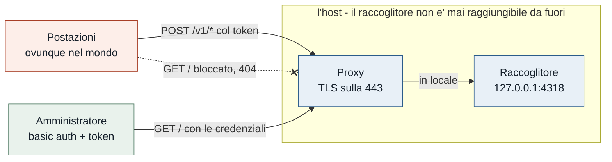

# Attivare CAM in un team distribuito geograficamente

Guida completa per il caso in cui le postazioni **non stanno sulla stessa rete**: case,
uffici diversi, paesi diversi, gente in viaggio. E in cui **il pannello di controllo lo deve
vedere solo l'amministratore**.

Se invece il gruppo lavora tutto sulla stessa LAN aziendale, la guida giusta è quella nel
[README](../README.md#attivarlo-parte-prima-la-macchina-che-raccoglie): è più corta, e qui
molte precauzioni non servirebbero.

---

## Perché serve una guida a parte

Il README descrive l'installazione **in sede**, e in quattro punti quella procedura non regge
fuori:

| Nel README | Perché non basta qui |
|---|---|
| `--host 0.0.0.0` sulla porta 4318 | esporrebbe il raccoglitore su Internet in chiaro |
| Regola firewall `-Profile Domain` | il profilo di dominio non esiste per chi lavora da casa |
| «il token serve agli invii» | è **uno solo** e apre anche il cruscotto: contro il tuo requisito |
| Il pannello legge `cam-team.db` come file | l'amministratore non ce l'ha, se il raccoglitore è altrove |

Il resto — agente, telemetria, riservatezza, riconciliazione — funziona identico. L'agente in
particolare **parla solo in uscita** e non apre porte: da questo lato una postazione a casa è
uguale a una in ufficio.

---

## Il vincolo che decide l'architettura

Il tuo requisito è: **il pannello lo vede solo un amministratore**. Il codice, oggi, non lo sa
fare da solo — `_autorizzato()` non distingue le rotte, quindi lo stesso token che dài a una
postazione per scrivere le permette anche di leggere il cruscotto di tutti.

La buona notizia è che **le rotte sono già separate**, anche se il token non lo è:

| | rotte | chi deve poterle usare |
|---|---|---|
| **Scrittura** | `POST /v1/sessions`, `POST /v1/metrics` | ogni postazione, da ovunque |
| **Lettura** | `GET /`, `GET /api/summary`, `GET /api/team` | **solo l'amministratore** |
| Diagnostica | `GET /healthz` | solo l'amministratore |



La separazione si mette quindi **davanti** al raccoglitore, non dentro: il proxy fa passare le
rotte di scrittura e blocca quelle di lettura per chiunque non sia l'amministratore. Non è un
ripiego — è il punto in cui si può fare **oggi, senza toccare il codice**, e resta valida anche
quando i token separati arriveranno
([PF14](../TODO.md#pf14--il-raccoglitore-fuori-dalla-rete-aziendale)).

Un dettaglio che semplifica tutto: **il cruscotto è HTML renderizzato dal server**, non fa
chiamate `fetch` dal browser. Perciò basta lasciar passare `/` e il pannello funziona intero.

---

## Le due topologie possibili

### A — Rete privata (WireGuard, Tailscale)

Postazioni, raccoglitore e amministratore entrano in una rete privata. Il raccoglitore
ascolta **solo** sull'indirizzo di quella rete e non è mai su Internet.

- **Pro:** niente da esporre, HTTP in chiaro torna difendibile perché è già dentro un tunnel
  cifrato, e l'amministratore può leggere il file dell'archivio come se fosse in LAN.
- **Contro:** un client in più da installare e mantenere su ogni postazione; in alcune aziende
  non è consentito. Con Tailscale funziona anche dietro NAT senza aprire porte.

### B — Host pubblico con reverse proxy e TLS

Il raccoglitore ascolta su `127.0.0.1`, e davanti c'è un proxy che termina TLS sulla 443.

- **Pro:** niente da installare sulle postazioni; la 443 in uscita non è mai bloccata, da
  nessuna rete e da nessun paese.
- **Contro:** c'è un servizio pubblico da tenere aggiornato, e se l'host è affittato la chiave
  degli pseudonimi finisce su un disco che non è tuo (vedi sotto).

**Quale scegliere.** Se puoi installare un client VPN su tutte le postazioni, **A** è più
semplice e più sicura. Se le postazioni sono sparse e non governi il loro software — il caso
tipico di un team distribuito — prendi **B**: è quella descritta per esteso qui sotto. Le due
si combinano bene, e la combinazione è la migliore delle tre: **B per le postazioni, A per
l'amministratore**.

---

## Dove mettere il raccoglitore

Tre requisiti, in ordine di importanza.

**1. Acceso sempre.** Non è un consiglio di comodità: **un raccoglitore fermo non lascia
traccia**. L'esportatore di Claude Code ritenta per poco e poi lascia perdere, e quell'intervallo
non si recupera più. Con un gruppo su più fusi orari «di notte» non esiste: qualcuno sta
lavorando. Quindi **non il portatile dell'amministratore**.

**2. Un indirizzo stabile e un nome DNS**, per il certificato.

**3. Un disco di cui ti fidi.** Qui sta l'unico compromesso serio di questa topologia. La regola
del livello `pseudonimo` è che la chiave stia in una cartella diversa dall'archivio, con permessi
diversi, così chi ha l'archivio non risale alle persone. Su una macchina affittata **entrambi
stanno sullo stesso disco, sotto lo stesso root, dentro gli stessi snapshot del fornitore**.

Non c'è configurazione che lo risolva. Le uscite vere sono tre, e vanno scelte consapevolmente:

| Uscita | Cosa comporta |
|---|---|
| Hardware tuo con nome pubblico (un box in un ufficio, un NAS) | risolve tutto, richiede una sede con connettività stabile |
| VPS, accettando il rischio | va detto a chi è misurato: è un trattamento di dati personali fuori sede |
| `--privacy aggregato` | nessuna identità in archivio, e la chiave non serve più — ma perdi la scheda Persone, cioè il motivo per cui stai installando questo |

---

# Parte 1 — L'host del raccoglitore

Esempi su Debian/Ubuntu, dove il raccoglitore è
[provato](../TODO.md#pf11--prove-su-macos-e-linux). Il nome `cam.azienda.it` va sostituito col
tuo, e deve già puntare in DNS a questo host.

### 1. Il token condiviso

```sh
python3 -c "import secrets; print(secrets.token_urlsafe(24))"
```

Conservalo dove conservi le altre credenziali. Lo vedranno tutte le postazioni: è inevitabile,
perché sta nel loro `settings.json`.

### 2. Le due cartelle

L'archivio e la chiave **separati, con permessi diversi**.

```sh
sudo useradd --system --home /var/lib/cam --shell /usr/sbin/nologin cam
sudo install -d -o cam -g cam -m 750 /var/lib/cam
sudo install -d -o cam -g cam -m 700 /var/lib/cam/chiavi
```

### 3. Il raccoglitore, in ascolto solo in locale

**`--host 127.0.0.1`, non `0.0.0.0`.** È il proxy a parlare col mondo; il raccoglitore non deve
essere raggiungibile direttamente, altrimenti tutto il lavoro sulla separazione delle rotte si
aggira collegandosi alla 4318.

```sh
sudo -u cam python3 /opt/cam/cam_collector.py \
    --host 127.0.0.1 --port 4318 \
    --token IL-TOKEN \
    --privacy pseudonimo \
    --db  /var/lib/cam/cam-team.db \
    --key /var/lib/cam/chiavi/cam-pseudonimi.key
```

Provalo a mano una volta, poi fermalo e mettilo in servizio:

```sh
python3 /opt/cam/cam_collector.py --setup-service \
    --host 127.0.0.1 --port 4318 --privacy pseudonimo --db /var/lib/cam/cam-team.db
```

Stampa l'unità systemd già compilata. Aggiungi a mano `--token` e `--key`, che
`--setup-service` non ripete perché non glieli hai passati, e usa un'unità **di sistema**
(`/etc/systemd/system/`), non d'utente: deve partire senza che nessuno faccia l'accesso.

### 4. Il proxy: TLS, e la separazione fra chi scrive e chi legge

[Caddy](https://caddyserver.com) prende il certificato da Let's Encrypt da solo e si rinnova da
solo. Genera prima la password dell'amministratore:

```sh
caddy hash-password --plaintext 'una-password-lunga'
```

`/etc/caddy/Caddyfile`:

```caddyfile
cam.azienda.it {
    encode gzip

    # --- Il pannello: solo l'amministratore --------------------------------
    # Prima le rotte di lettura, perché "/" prenderebbe tutto.
    @pannello path / /api/summary /api/team /healthz
    handle @pannello {
        basic_auth {
            admin $2a$14$METTI-QUI-L-HASH-GENERATO-SOPRA
        }
        reverse_proxy 127.0.0.1:4318
    }

    # --- L'ingresso dei dati: le postazioni, da ovunque --------------------
    # Qui NON va la basic auth: la credenziale è il token, che il raccoglitore
    # controlla da sé sull'intestazione Authorization.
    handle /v1/* {
        reverse_proxy 127.0.0.1:4318
    }

    # Tutto il resto non esiste.
    handle {
        respond 404
    }
}
```

Tre scelte che vale la pena capire invece di copiare:

- **`respond 404`, non 403.** Un 403 dice «qui c'è qualcosa che non puoi vedere». Un 404 non dice
  niente, ed è la risposta giusta per un pannello che non deve risultare nemmeno esistente.
- **La basic auth non copre `/v1/*`.** Se la mettessi lì, dovresti distribuire *anche* quella
  password a ogni postazione, e torneresti ad avere una sola credenziale per tutto — cioè il
  problema da cui sei partito.
- **Il token resta obbligatorio anche per l'amministratore.** Il raccoglitore lo pretende su ogni
  rotta, quindi il pannello si apre con `https://cam.azienda.it/?token=IL-TOKEN` **dopo** la
  basic auth. Due credenziali diverse per due controlli diversi.

Se l'amministratore ha un indirizzo IP fisso, puoi stringere ancora aggiungendo dentro
`handle @pannello`, prima della basic auth:

```caddyfile
        @estranei not remote_ip 203.0.113.7
        respond @estranei 404
```

Su un team distribuito però l'amministratore è spesso mobile quanto gli altri: se l'IP cambia, la
basic auth da sola è la scelta che non ti chiude fuori.

### 5. Il firewall

Solo 80 e 443. La 4318 **non va aperta**: se lo fosse, il proxy diventerebbe decorativo.

```sh
sudo ufw allow 80/tcp     # serve a Let's Encrypt per il rinnovo
sudo ufw allow 443/tcp
sudo ufw enable
```

### 6. Verifica prima di toccare le postazioni

```sh
# le postazioni devono poter scrivere (405 = rotta viva, metodo sbagliato: va bene)
curl -s -o /dev/null -w '%{http_code}\n' https://cam.azienda.it/v1/metrics

# il pannello NON deve rispondere senza credenziali
curl -s -o /dev/null -w '%{http_code}\n' https://cam.azienda.it/
# atteso: 401 dalla basic auth

# con le credenziali, sì
curl -s -u admin:una-password-lunga "https://cam.azienda.it/healthz?token=IL-TOKEN"

# e la 4318 non deve essere raggiungibile da fuori
curl -s --max-time 5 http://cam.azienda.it:4318/healthz ; echo "  <- deve fallire"
```

Le ultime due righe sono le uniche che verificano il tuo requisito. Falle davvero.

---

# Parte 2 — Ogni postazione, ovunque si trovi

Cinque minuti a persona, e sono **due cose distinte**: la telemetria la manda Claude Code da sé,
lo storico lo recupera l'agente. Nessuna delle due apre porte sulla macchina.

### 7. Il blocco di configurazione

Si genera **sul raccoglitore**, e ora accetta l'indirizzo pubblico completo:

```sh
python3 cam_collector.py --setup --host https://cam.azienda.it --token IL-TOKEN
```

> Se `--host` è un indirizzo completo viene usato così com'è. Passando solo il nome
> otterresti `http://cam.azienda.it:4318`, cioè la porta interna in chiaro: sbagliata da fuori.

### 8. Applicarlo

Il blocco `env` va nel `~/.claude/settings.json` di ciascuno, oppure — meglio per un team — nel
file centralizzato non modificabile dall'utente:

| Sistema | `managed-settings.json` |
|---|---|
| Windows | `C:\Program Files\ClaudeCode\managed-settings.json` |
| macOS | `/Library/Application Support/ClaudeCode/managed-settings.json` |
| Linux | `/etc/claude-code/managed-settings.json` |

**Poi riavvia Claude Code.** Le variabili si leggono all'avvio, e senza riavvio non arriva niente
**senza nessun messaggio di errore da nessuna parte**. È il passo che si dimentica sempre.

### 9. L'agente

Sulla postazione servono **due file soli**: `cam.py` e `cam_agent.py`. Nessuna dipendenza,
`config.json` non è obbligatorio.

```bat
python cam_agent.py --endpoint https://cam.azienda.it --token IL-TOKEN --dry-run
python cam_agent.py --endpoint https://cam.azienda.it --token IL-TOKEN --once
python cam_agent.py --setup-service
```

`--dry-run` calcola e mostra senza spedire: se il numero è plausibile, prosegui. In alternativa
agli argomenti si possono usare le variabili `CAM_ENDPOINT` e `CAM_TOKEN`.

L'agente esiste perché **la telemetria parte dal giorno in cui la accendi**. Sulla macchina di
sviluppo, il giorno dell'accensione, copriva lo 0,00% del consumo totale: $0,10 contro $2.958,85
già sul disco nei transcript. L'agente li rilegge, calcola la differenza rispetto a quanto già
spedito e manda solo quella.

### 10. Che una postazione fuori rete non è un caso speciale

Vale la pena dirlo a chi installa: l'agente **parla solo in uscita**, verso la 443. Funziona
identico in ufficio, a casa, in VPN, su una rete d'albergo e in aereo — quando torna online
recupera l'arretrato da sé. Non apre porte e non aggiunge superficie di attacco alla macchina di
nessuno.

---

# Parte 3 — L'amministratore e il pannello

Due modi, e conviene averli entrambi.

### Il cruscotto web, da qualunque parte del mondo

```
https://cam.azienda.it/?token=IL-TOKEN
```

Con la basic auth davanti. È HTML servito dal server, quindi funziona su qualunque browser senza
altro.

### Il pannello vero, con la scheda Persone

La GUI **legge `cam-team.db` come file**, non via rete: non esiste un modo di puntarla a un
indirizzo HTTP. Per avere la scheda Persone completa — drill-down sui progetti, riconciliazione,
adozione mese per mese — serve una copia locale dell'archivio.

```powershell
# una volta al giorno, o quando serve
scp cam@cam.azienda.it:/var/lib/cam/cam-team.db C:\claude-team\cam-team.db
```

e in `config.json` della macchina dell'amministratore:

```json
"team": {
  "seats": 12,
  "fee_per_seat": 122.0,
  "currency": "EUR",
  "db": "C:\\claude-team\\cam-team.db"
}
```

Due avvertenze sulla copia:

- **copia anche `-wal` e `-shm`**, oppure fai la copia con `sqlite3 ... ".backup"` sul server:
  finché SQLite non fa il checkpoint, i dati più recenti stanno nel `-wal` e non nel `.db`, e
  una copia del solo `.db` sarebbe vecchia senza dirlo;
- **è una copia in sola lettura.** Non rimandarla indietro: sovrascriverebbe quello che le
  postazioni hanno spedito nel frattempo.

Comando consigliato, che evita entrambi i problemi:

```sh
ssh cam@cam.azienda.it "sqlite3 /var/lib/cam/cam-team.db \".backup '/tmp/cam-snapshot.db'\""
scp cam@cam.azienda.it:/tmp/cam-snapshot.db C:\claude-team\cam-team.db
```

### `seats`, che qui pesa più che altrove

Le postazioni ferme **non si vedono, si deducono**: chi non usa lo strumento non manda niente e
non compare da nessuna parte. In un team distribuito è ancora più facile che qualcuno smetta
senza che nessuno se ne accorga. Dichiara `seats` e tienilo aggiornato: è l'unico modo perché la
domanda «quante licenze pago a vuoto» abbia una risposta.

---

## Chi vede cosa, alla fine

| | può scrivere | può vedere il pannello | vede i propri dati |
|---|---|---|---|
| Una postazione | **sì** (token) | **no** (404 dal proxy) | no |
| L'amministratore | sì | **sì** (basic auth + token) | sì, di tutti |
| Chiunque altro su Internet | no | no | no |

Con `--privacy pseudonimo` l'amministratore vede **codici**, non indirizzi, a meno di avere anche
la chiave. Il livello è scritto in testa a ogni riepilogo, così chi riceve un documento non deve
chiedere cosa ha in mano.

---

## Manutenzione

```sh
python3 cam_collector.py --status --host https://cam.azienda.it --token IL-TOKEN
```

Il token serve anche qui: senza, un raccoglitore protetto risulterebbe **spento** invece che
protetto, e sono due diagnosi opposte. Esce con codice 1 se trova qualcosa, quindi si mette in un
controllo automatico.

Segnala da solo i due casi che altrimenti si notano tardi: una postazione il cui agente tace da
più di un giorno, e una che manda telemetria ma non ha l'agente — quindi contribuisce ai totali
ma non allo storico.

| Cosa vedi | Di solito è |
|---|---|
| Una postazione sparita | macchina spenta o ferie: guarda la data dell'ultimo invio |
| Agente muto, telemetria viva | collegamento di avvio automatico rimosso |
| Telemetria muta, agente vivo | Claude Code non riavviato, o token mancante nell'intestazione |
| Tutti muti insieme | il raccoglitore è fermo, o il certificato è scaduto |
| Una persona due volte | `agent.json` cancellato, o indirizzo diverso da quello in fattura |

L'ultima riga della tabella è più probabile qui che in sede: chi lavora da più macchine (fisso e
portatile) compare come due postazioni, perché l'identificativo sta in `agent.json` ed è per
macchina. Non è un errore, ma va saputo prima di contare le postazioni attive.

**Quando qualcuno chiede la cancellazione dei propri dati:**

```sh
python3 cam_collector.py --dimentica nome@azienda.it \
    --db /var/lib/cam/cam-team.db --key /var/lib/cam/chiavi/cam-pseudonimi.key
```

Cancella da tutte e tre le tabelle. Senza la chiave giusta **si ferma**, invece di calcolare un
codice diverso e cancellare zero righe dicendo che ha finito.

---

## Quello che resta scoperto, e va saputo

- **Il token è uno solo.** Il proxy separa chi legge da chi scrive a livello di URL, e per il tuo
  requisito basta. Ma chiunque abbia il token e riesca a parlare direttamente con la 4318 —
  cioè chi ha accesso all'host — passa sopra la separazione. Token distinti per lettura e
  scrittura sono [PF14](../TODO.md#pf14--il-raccoglitore-fuori-dalla-rete-aziendale).
- **Il raccoglitore non parla TLS da sé.** Il cifrato lo mette il proxy. Se un giorno il proxy
  sparisce dalla configurazione, il raccoglitore continua a funzionare in chiaro senza lamentarsi:
  è la cosa da controllare dopo ogni intervento sull'host.
- **La chiave degli pseudonimi su hardware altrui** non offre la garanzia che offre in sede. Vedi
  [Dove mettere il raccoglitore](#dove-mettere-il-raccoglitore).
- **La GUI non parla con il raccoglitore via rete**, e il file va copiato a mano o a scadenza.

---

## Elenco di controllo

Da spuntare prima di dire che è attivo:

- [ ] Il raccoglitore ascolta su `127.0.0.1`, non su `0.0.0.0`
- [ ] La 4318 non è raggiungibile da Internet — **verificato con `curl`, non supposto**
- [ ] `https://cam.azienda.it/` risponde 401 senza credenziali
- [ ] `https://cam.azienda.it/v1/metrics` è raggiungibile da una postazione
- [ ] Archivio e chiave in cartelle diverse, con permessi diversi
- [ ] Il raccoglitore riparte da solo dopo un reboot dell'host (provalo: riavvia)
- [ ] Claude Code è stato **riavviato** su ogni postazione dopo il blocco `env`
- [ ] `--status` elenca tutte le postazioni attese, nessuna muta
- [ ] `seats` dichiarato e pari alle licenze pagate
- [ ] L'amministratore sa che il pannello vuole basic auth **e** `?token=`
